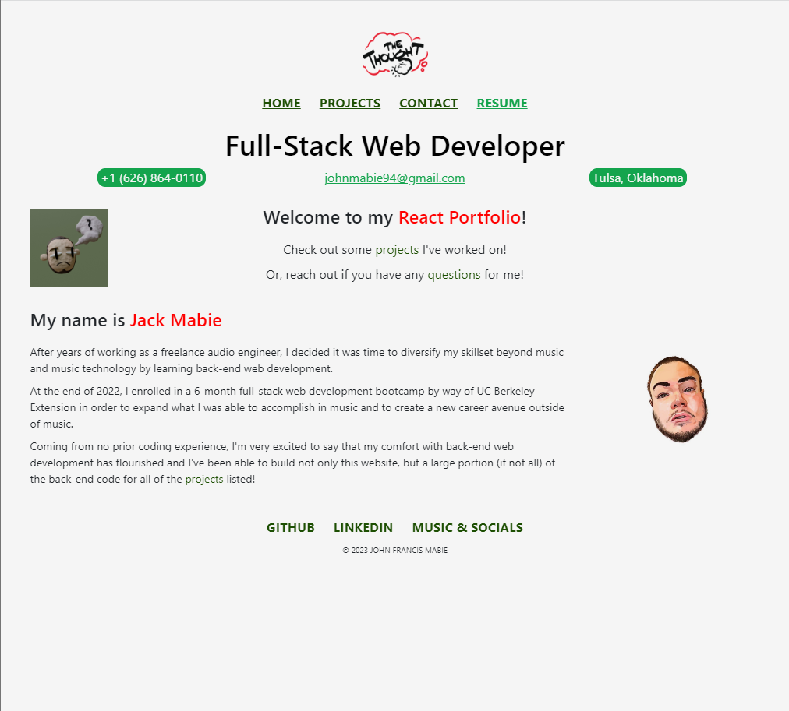
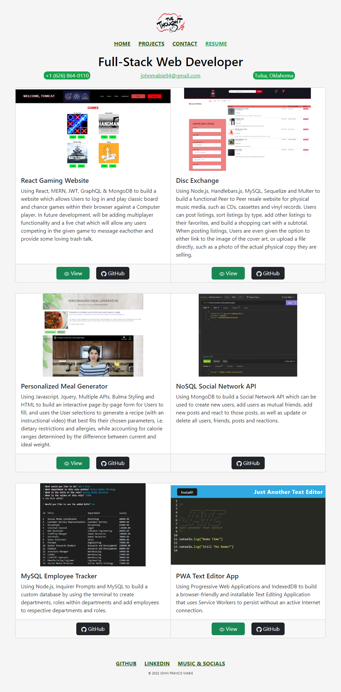
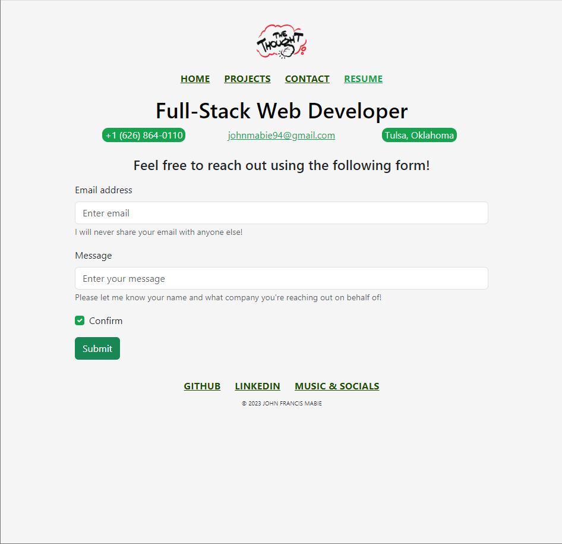

# React Portfolio v2

## Description

#### Using the React framework and the React-Bootstrap style library to recreate my React Portfolio from scratch with a functional Projects page and an interactive Contacts page.
---

## Contents
- [User Story](#user-story)
- [Installation](#installation)
- [Media](#media)
- [Credits](#credits)
- [Technology Used](#technology-used)
- [Notes](#notes)
- [License](#license)
​
### User Story
```md
AS AN employer looking for candidates with experience building single-page applications
I WANT to view a potential employee's deployed React portfolio of work samples
SO THAT I can assess whether they're a good candidate for an open position
```
## Installation:

Utilizing the Application is simple!

Option A - Use the GitHub Pages Deployment directly by way of https://jmabie94.github.io/react-portfolio-v2/.

Option B - Clone the repo:
    
    git clone git@github.com:jmabie94/react-portfolio-v2.git

Next, open an integrated terminal in your cloned folder and do the following:
    
    run "npm init -y"
    run "npm i"

After Node Packages have installed, open run the application:

    run "npm run start"


Finally, the application should open automatically in your browser!
​
## Media

### v2 Styling - Home Page:


### v2 Styling - Projects Page:


### v2 Styling - Contact Page:

​
## Credits
- Jack Mabie (https://github.com/jmabie94)
​
## Technology Used
    - Javascript
    - React
    - React-Bootstrap
    - Prettier
    - Multiple StackOverflow Forum Threads
    - GH-Pages
    - Service Workers
    - Tutoring

## Notes
This is a complete overhaul of my initial attempt at my React Portfolio, styling has been consistently the most difficult part of my coding experience (hence my intention to focus on back-end development), so I apologize for the lack of flashiness!
    
## License
​
[](https://opensource.org/licenses/MIT)
​
MIT License
Copyright (c) [2023] [The Five Loopers]
Permission is hereby granted, free of charge, to any person obtaining a copy
of this software and associated documentation files (the "Software"), to deal
in the Software without restriction, including without limitation the rights
to use, copy, modify, merge, publish, distribute, sublicense, and/or sell
copies of the Software, and to permit persons to whom the Software is
furnished to do so, subject to the following conditions:
The above copyright notice and this permission notice shall be included in all
copies or substantial portions of the Software.
THE SOFTWARE IS PROVIDED "AS IS", WITHOUT WARRANTY OF ANY KIND, EXPRESS OR
IMPLIED, INCLUDING BUT NOT LIMITED TO THE WARRANTIES OF MERCHANTABILITY,
FITNESS FOR A PARTICULAR PURPOSE AND NONINFRINGEMENT. IN NO EVENT SHALL THE
AUTHORS OR COPYRIGHT HOLDERS BE LIABLE FOR ANY CLAIM, DAMAGES OR OTHER
LIABILITY, WHETHER IN AN ACTION OF CONTRACT, TORT OR OTHERWISE, ARISING FROM,
OUT OF OR IN CONNECTION WITH THE SOFTWARE OR THE USE OR OTHER DEALINGS IN THE
SOFTWARE.
​
---

<!-- 
CAREER COACH NOTES - WORKING LIST

4.  Maybe add blog?

5.  For Project 2 / Disc Exchange fork the repository and rename so that it's not just /Project-2 and can actually show /DiscExchange or something along those lines - also add descriptions! (Probably best to do this as well for LazyLoaderMealGenerator) - also remove "Group 7" from Game Room App

6.  Do a proper README for the new React Portfolio

7.  LazyLoader README could use styling adjustment to be more consistent with the other Projects

8.  Use LinkedIn headline and primary languages in the GitHub bio section so it's not just name and @. Corey sent this: "Full Stack Developer | Javascript | SQL | ReactJS"

9.  Add websites to Linkedin Contact section (Portfolio!) Also, consider simplifying first line on the LinkedIn bio so that it focuses in on the Web Dev stuff.

10. Add Bootcamp Certificate as Media in the FEATURED section of LinkedIn, and add all of the coding projects in the FEATURED section as links, highlighting them on the page earlier. Add some additional coding stuff to the SKILLS section including APIs and the back-end stuff that was omitted, then reorder to highlight the top skills I have.

11. Go through the LinkedIn networks of companies, filter for closest regions, filter for software engineers and take a look through (and potentially reach out to) profiles to see what it takes to work at such company or what I could do to get qualified for better consideration. -->